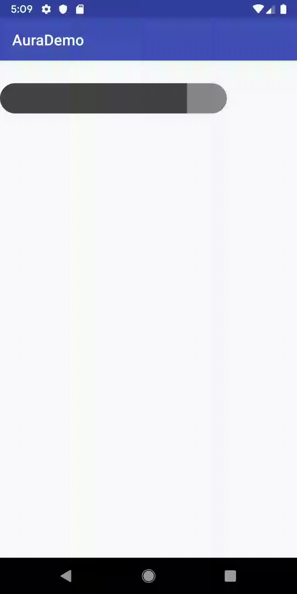

Aura Progress Bar
-----------------

A Simple progress bar.

Implemented with canvas drawing and Animator.



##### Usage 

###### Xml
```xml
<com.larryhsiao.aura.view.progressbar.AuraProgressBar
    android:id="@+id/auraProgressBar"
    android:layout_width="300dp"
    android:layout_height="100dp"
    app:bgColor="{color}"
    app:progress="{progress}"
    app:progressColor="{color}" />
```

###### Java

```kotlin
val progressBar:AuraProgressBar = findViewById(R.id.auraProgressBar)
progressBar.updateProgressAnimated(progress) // 0f ~ 1f

// or no animation
progressBar.updateProgress(progress)

```


