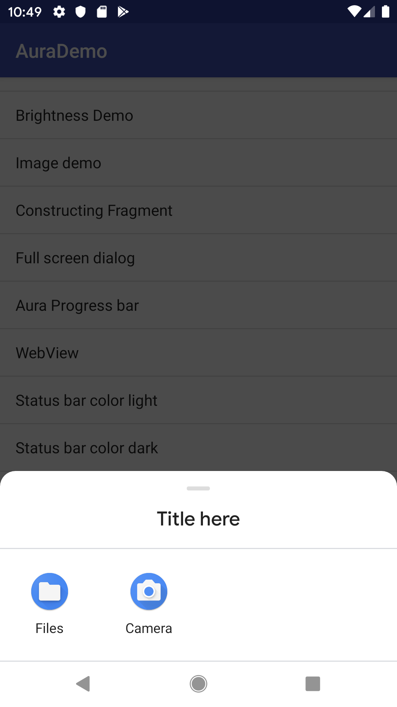

ChooserIntent
-----

In our day to day Android app development work. There are time to time scenario we have to provide action selection dialog for various purpose. Here is a alternative to custom a dialog, ChooserIntent, which is a Source class wraps Intent.createChooser for creating Chooser dialog with custom options.



```kotlin
startActivity(
    ChooserIntent(
            "Title here",
            Intent(MediaStore.ACTION_IMAGE_CAPTURE),
            Intent(ACTION_GET_CONTENT).also{
                it.type = "images/*"
            }
    ).value()
)
```